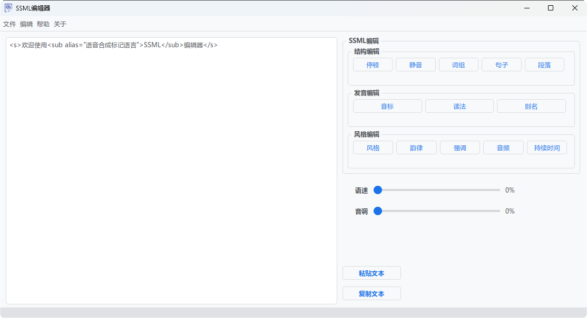

# SSML编辑器

简介
---

本软件旨在为减少使用语音合成标记语言（SSML）的工作量，使用Pyside6构建

目前问题
---
1.风格功能不完善
2.韵律功能暂时未做
3.部分文字渲染存在问题

将解决
---
1.字符串拼接弃用加号连接
2.文字渲染优化
3.菜单栏功能补全
4.文本编辑区显示行号
5.语法高亮
6.自动格式化文档

第三方包
---
1.pyside6
2.qdarktheme

